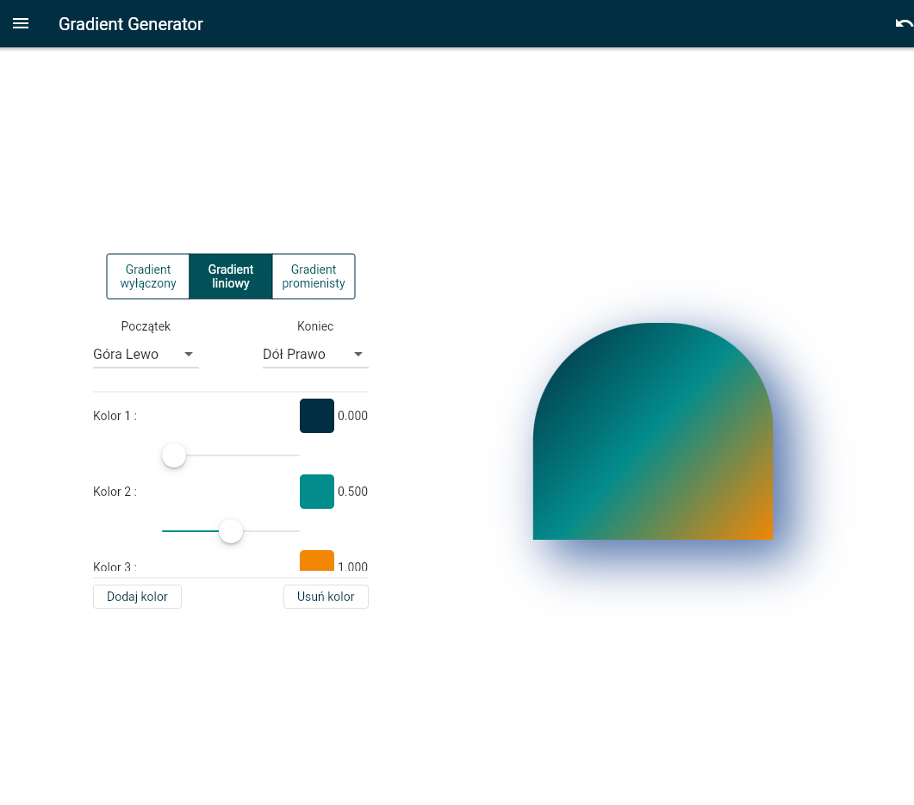
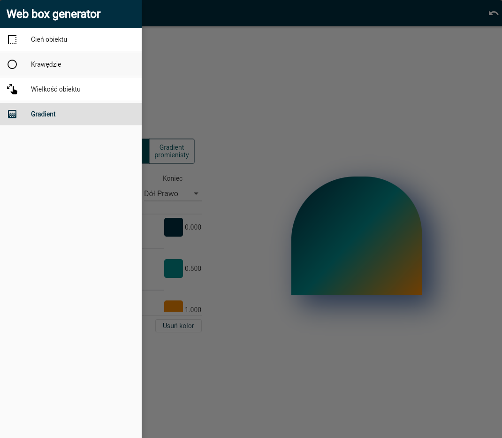

# FLUTTER WEB GENERATOR

Flutter gradient and shadow generator with customization options. The application allows you to create and test widgets with gradients and shadows on the web to easily apply them to your Flutter applications. 🚀

## Tech Stack
- Bloc/Cubit
- Freezed
- Hydrated
- Intl
- Clean Architecture

## Inspiration
App is inspired in design and functionality to [CSS Box Shadow Generator](https://cssgenerator.pl/box-shadow-generator), but has features adapted to Flutter.

## Live Demo
[Web Generator Demo Link](https://wieczorek0807.github.io/web_generator/)

## App Preview

